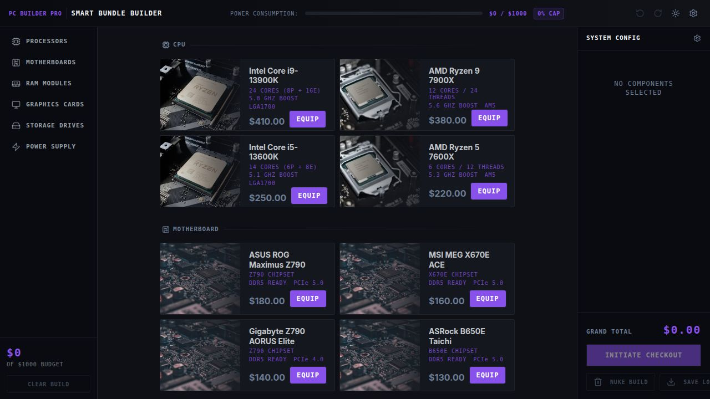
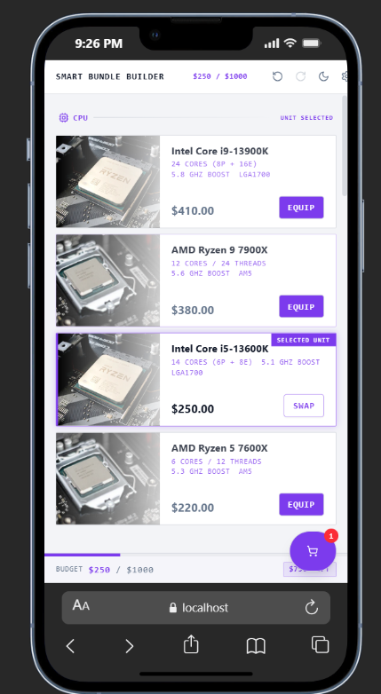

 Smart Bundle Builder — PC Configuration Platform

A modern PC configuration platform that allows users to build a compatible custom PC bundle within a fixed **$1,000 budget**.

---

# Preview

<p align="center">
  
  
</p>

## Core Capabilities

- Component selection system
- Budget validation
- Compatibility checks
- Undo / Redo support
- PDF export
- Theme persistence
- Responsive design
- Toast notifications
- Accessible UI primitives

---

# Tech Stack

| Technology | Purpose |
|---|---|
| React | UI rendering |
| TypeScript | Static typing |
| Redux Toolkit | Global state management |
| Vite | Development/build tooling |
| Tailwind CSS v4 | Styling |
| Shadcn/ui | UI components |
| Radix UI | Accessible primitives |
| jsPDF | PDF export |
| html2canvas | DOM capture |

---

# How to Run

```bash
# Install dependencies
npm install

# Start development server
npm run dev

# Type checking
npm run typecheck

# Production build
npm run build

# Preview production build
npm run serve
```

Development server:

```txt
http://localhost:5173
```

---

# Undo/Redo Architecture

Undo/Redo is implemented using a **linear history stack** inside a single Redux slice (`buildSlice.ts`).

 Why a Linear History Stack? WHY NOT COMMANT PATTERN EVENT OR Event Sourcing? I WILL TELL YOU IN INTERVIEW 

The state follows a classic triple-buffer structure:

```ts
{
  past: BuildSnapshot[],
  present: BuildSnapshot,
  future: BuildSnapshot[]
}
```

---

# Snapshot Structure

```ts
interface BuildSnapshot {
  selectedIds: Record<string, string>;
}
```

Example snapshot:

```ts
{
  cpu: "ryzen-7",
  gpu: "rtx-4070",
  ram: "corsair-32gb"
}
```

The application stores only normalized primitive mappings,
which keeps snapshots lightweight and efficient to clone.

Because the state shape is flat and predictable,
shallow cloning is sufficient.

---

# How Undo/Redo Works

## State Mutations

Every mutation:

- stores the current snapshot in `past`
- applies a new snapshot to `present`
- clears `future`
- enforces a capped history size

```ts
past.push(present)
present = nextState
future = []
```

---

## Undo

```ts
future.unshift(present)
present = past.pop()
```

---

## Redo

```ts
past.push(present)
present = future.shift()
```

---


## Special Notes

- **Vercel deployment**: the Vite build outputs to `dist/public/`. A `vercel.json` file tells Vercel where to find the built files.
- **Single-page app**: no client-side router — the entire UI lives on one page. No need for SPA fallback rewrites on Vercel.
- **Budget enforcement**: selecting a component that exceeds the $1,000 cap is prevented client-side, with a toast notification showing the overage.
- **Compatibility**: components can declare `incompatibleWith` IDs. Selection handlers can be extended to enforce these rules at the UI level.
- **PDF export**: uses `jsPDF` and `html2canvas` to generate a printable build summary with a budget usage bar.
- **Theme**: light/dark mode toggled via CSS class on `<html>`, persisted through a custom hook.
- **Shadcn/ui**: UI primitives (dialogs, tooltips, toasts, scroll areas) powered by Radix and styled with Tailwind.
